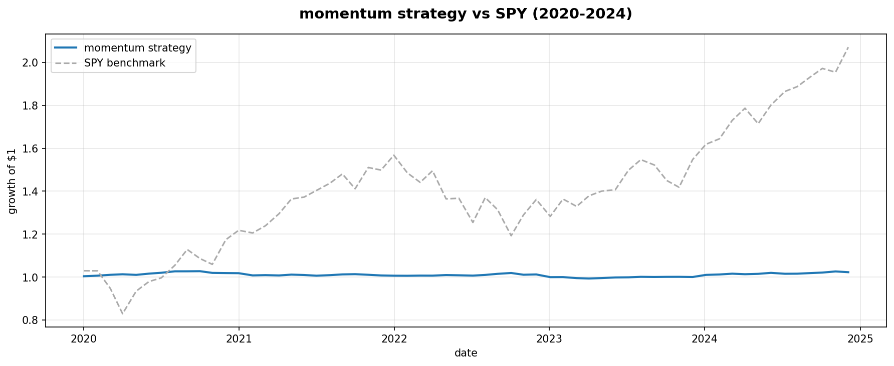
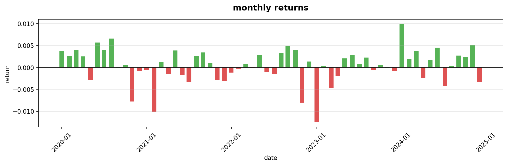
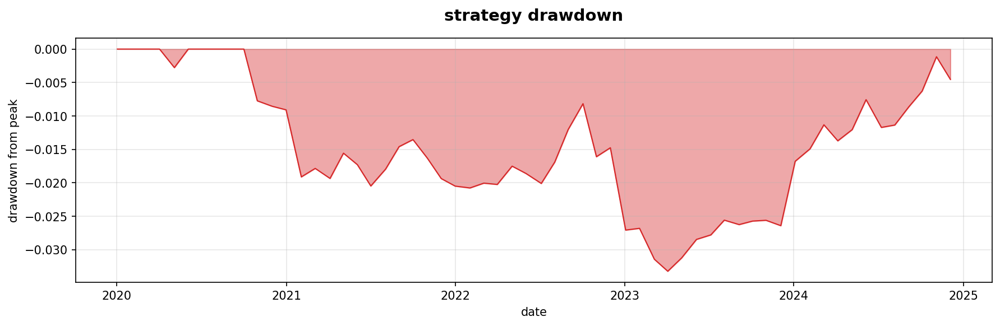

# momentum-equity-research

I got interested in quant finance a few months ago and kept seeing 
"momentum" mentioned everywhere, in job descriptions, in research 
papers, in interviews. I had no idea what it actually meant in 
practice so I decided to just build it and find out.

This is a from-scratch implementation of a cross-sectional momentum 
strategy on S&P 500 stocks, backtested over 2020-2024. Nothing 
fancy, just enough to understand how the signal works and whether 
it holds up on real data.

## the idea

Stocks that have been going up over the past year tend to keep going 
up. Stocks that have been falling tend to keep falling. This sounds 
obvious but it's one of the most documented patterns in finance 
(Jegadeesh & Titman 1993 if you want to go down that rabbit hole).

Every month the strategy ranks 18 S&P 500 stocks by their return 
over the past 12 months, skipping the most recent month to avoid 
short-term reversal, and goes long the top 5, short the bottom 5.

## results

60 monthly periods, 2020-2024.

| metric | value |
|--------|-------|
| annualised return | 0.5% |
| sharpe ratio | 0.33 |
| max drawdown | -3.3% |
| hit rate | 60% |

The absolute return looks terrible compared to just holding SPY, 
but that's kind of the point, this is a market-neutral strategy, 
not a buy-and-hold one. It's supposed to make money regardless of 
whether the market goes up or down.

The number I actually care about is the 60% hit rate. It means the 
signal was right more often than wrong, which suggests momentum is 
real in this universe even if the returns are small.

It struggled in 2021-2023. Looking back that makes sense — there 
was a lot of sector rotation during that period where recent winners 
suddenly reversed. Classic momentum crash environment.

## what tripped me up

Look-ahead bias. I didn't know what this was before starting and it 
took me a while to get right. The problem is it's easy to 
accidentally use future data in a backtest. for example using the 
same day's return to generate the signal AND measure performance. 
Fixed it by shifting forward returns by one day so the portfolio 
only earns returns after the signal is computed, not on the same 
day.

## what I'd do differently

- use the full S&P 500 instead of 18 stocks — more stocks means 
  a cleaner signal
- model transaction costs — right now assumes free trading
- test other signals (value, low vol) alongside momentum
- try an ML model to combine signals

## charts







## how to run

```bash
git clone https://github.com/Hena3124/momentum-equity-research
cd momentum-equity-research
pip install -r requirements.txt
python data.py
python signals.py
python backtest.py
python charts.py
```

## stack
Python · pandas · NumPy · yfinance · matplotlib

## limitations
- small universe (18 stocks) — not enough breadth for a strong signal
- no transaction costs
- survivorship bias — all stocks I picked are still trading today
- short selling assumed to be free (no borrow costs)